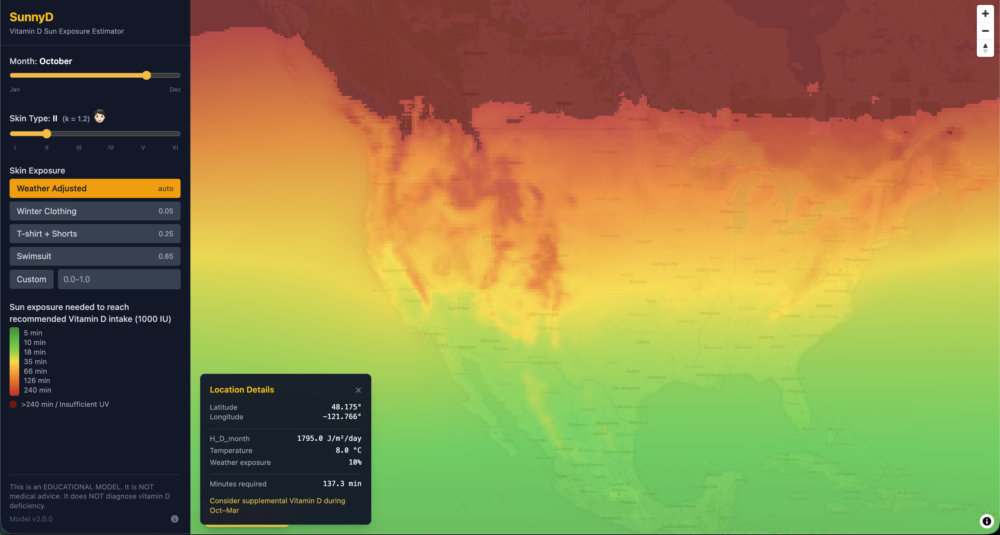

# SunnyD — Global Vitamin D Sun Exposure Estimator 🌞

Estimates how many minutes of midday sun are required to synthesise a target daily vitamin D intake, by location, month, skin type, and skin exposure.


> **This is an EDUCATIONAL MODEL.**
> It is **not** medical advice.
> It does **not** diagnose vitamin D deficiency.

## Architecture

SunnyD is a fully static React app — no backend server at runtime. Source
climate data (UV dose + temperature) is pre-processed into compact binary grid
files that the browser loads on demand (~1-2 MB per month, Brotli-compressed).

All computation happens client-side:

- **Tile rendering**: the browser samples the in-memory grids into 256×256
  tiles using Mercator projection, colorizes via a pre-computed LUT, and
  encodes as raw PNG for MapLibre.
- **Point estimates**: on map click, the grid is sampled at the clicked
  lat/lon and minutes are computed with `(K_minutes * k_skin) / (H_D_kJ * f_cover)`.
- **Supplement advice**: all 12 months are checked to find months where
  required sun exposure exceeds 120 minutes.

A "Weather Adjusted" mode uses monthly temperature climatology to
automatically set skin coverage based on estimated local temperature.

### Grid encoding

Each grid file has a 20-byte header followed by `nlat × nlon` uint16 values:

```
encoded = round((value + offset) * scale)
0xFFFF = no-data / NaN
```

| Grid type   | Scale | Offset | Encoded range |
| ----------- | ----- | ------ | ------------- |
| UV dose     | 3     | 0      | 0 – 60,000    |
| Temperature | 100   | 50     | 0 – 11,000    |

Frontend decodes: `value = uint16_value / scale - offset`

## Data sources

### UV dose (UVB)

**TEMIS (KNMI) Vitamin-D-weighted UV Dose** — clear-sky climatology
(2004-2020 monthly averages, data version 2.0), exported 21 Feb 2026.

Download: <https://www.temis.nl/uvradiation/v2.0/nc/clim/uvdvcclim_world.nc>

> Van Geffen, J., Van Weele, M., Allaart, M. and Van der A, R.: 2017,
> TEMIS UV index and UV dose operational data products, version 2.
> Dataset. Royal Netherlands Meteorological Institute (KNMI).
> [doi.org/10.21944/temis-uv-oper-v2](https://doi.org/10.21944/temis-uv-oper-v2)

### Temperature

**ERA5 monthly averaged data on single levels from 1940 to present** —
0.25° x 0.25° global (land + ocean) 2m air temperature reanalysis from the
Copernicus Climate Data Store. Years used: 2016-2025 (10-year climatology).

Download: <https://cds.climate.copernicus.eu/datasets/reanalysis-era5-single-levels-monthly-means>

> Hersbach, H., Bell, B., Berrisford, P., Biavati, G., Horányi, A.,
> Muñoz Sabater, J., Nicolas, J., Peubey, C., Radu, R., Rozum, I.,
> Schepers, D., Simmons, A., Soci, C., Dee, D., Thépaut, J-N. (2023):
> ERA5 monthly averaged data on single levels from 1940 to present.
> Copernicus Climate Change Service (C3S) Climate Data Store (CDS).
> [doi:10.24381/cds.f17050d7](https://doi.org/10.24381/cds.f17050d7)

## Setup

### Prerequisites

- Python 3.12+ (for data pipeline only)
- Node.js 22+

### Data pipeline

The three numbered scripts in `scripts/` prepare the data:

```bash
pip install -r requirements.txt

# 1. Download TEMIS UV climatology and aggregate daily → monthly
python scripts/1_download_uv.py

# 2. Process ERA5 temperature into 12-month climatology
#    (requires manual download from CDS — see Data sources above)
python scripts/2_build_temperature_nc.py

# 3. Convert NetCDF files into per-month binary grids for the frontend
python scripts/3_build_grids.py
```

After step 3, `public/data/` will contain 24 `.bin` files (~2 MB each).

### Local development

```bash
npm install
npm run dev
```

The app will be available at `http://localhost:3000`.

### Production build

```bash
npm run build
```

Output is in `dist/` — deploy the entire directory to any static host
(Cloudflare Pages, Netlify, Vercel, etc.).

### Linting

```bash
npx tsc --noEmit   # type check
npm run lint        # eslint
```

## Model

The human body is treated as a 3D collector of the vitamin-D-weighted UV
energy reported by the TEMIS satellite.

### Variables

| Symbol      | Description                                                          |
| ----------- | -------------------------------------------------------------------- |
| `H_D`       | Daily Vitamin-D UV dose from TEMIS (kJ/m²)                           |
| `BSA`       | Total body surface area (≈ 1.8 m²)                                   |
| `f_exposed` | Fraction of skin exposed (0–1)                                       |
| `C_geo`     | Geometry factor = 0.33 (only ≈⅓ of exposed skin faces the sun)       |
| `T_peak`    | Solar window = 240 min (dose delivered over ~4 h midday)             |
| `E_target`  | 0.05 kJ (energy needed for 1,000 IU, based on 0.25 MED over 25% BSA) |
| `M_fitz`    | Fitzpatrick skin-type multiplier (see below)                         |

### Equations

**Energy rate hitting the skin (kJ/min):**

```
Rate = (H_D / T_peak) × (BSA × f_exposed × C_geo)
```

**Time to reach target energy:**

```
Time (min) = (E_target × M_fitz) / Rate
```

**Combined formula (with constants substituted):**

```
Time = (0.05 × 240 × M_fitz) / (H_D × 1.8 × f_exposed × 0.33)
```

Which simplifies to `K_minutes = 20.2`:

```
Time = (K_minutes × M_fitz) / (H_D × f_exposed)
```

If `H_D ≤ 0` or `f_exposed ≤ 0`, the result is **Infinity** (insufficient UV).

### Fitzpatrick skin-type multipliers

| Type | k_skin |
| ---- | ------ |
| I    | 1.0    |
| II   | 1.2    |
| III  | 1.5    |
| IV   | 2.0    |
| V    | 2.8    |
| VI   | 3.8    |

### Exposure presets

| Preset           | f_cover |
| ---------------- | ------- |
| Winter Clothing  | 0.05    |
| T-shirt + shorts | 0.25    |
| Swimsuit         | 0.85    |
| Weather Adjusted | auto    |

### Weather-adjusted mode

When enabled, skin coverage is computed from the ERA5 monthly mean 2m
temperature using a smoothstep interpolation between 5% (at 0°C) and
25% (at 25°C). Pixels without temperature data default to 25%.
